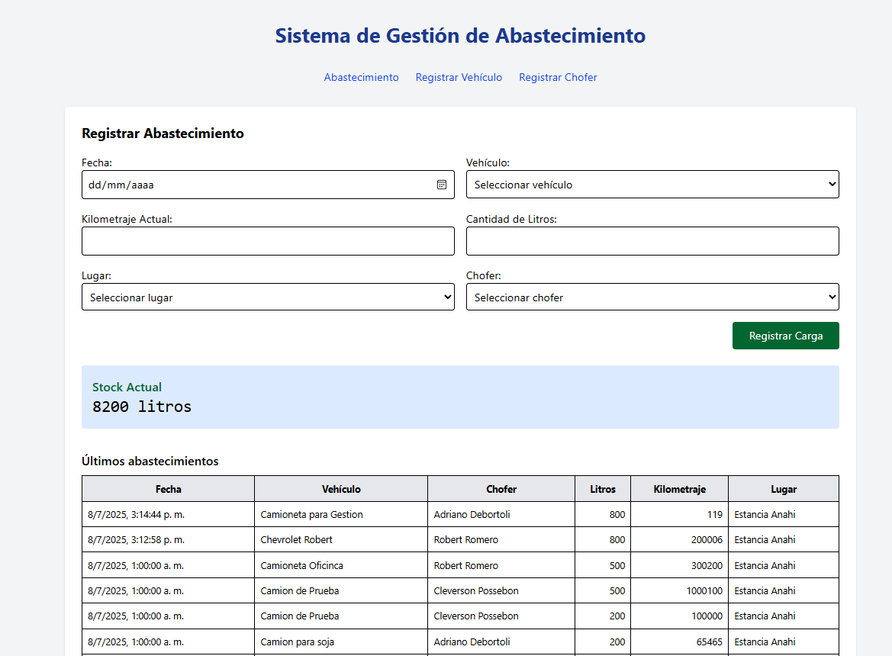

# 🛢️ Sistema de Gestión de Abastecimiento de Combustible

Aplicación web para registrar, controlar y visualizar abastecimientos de combustible, con control de stock y alarmas por nivel bajo.

---

## 📸 Captura de pantalla

 <!-- Guardá tu screenshot como 'captura.png' en /frontend/public -->

---

## ⚙️ Tecnologías utilizadas

- **Frontend:** React + Tailwind CSS + Vite
- **Backend:** Node.js + Express
- **Base de datos:** PostgreSQL
- **ORM / Query Layer:** SQL nativo con `pg`

---

## 🧰 Requisitos

- Node.js (v18 o superior)
- PostgreSQL (con una base de datos llamada `gestion_combustible`)

---

## 🚀 Instalación y ejecución

### 1. Clonar el repositorio

```bash
git clone https://github.com/tu-usuario/gestion-combustible.git
cd gestion-combustible
